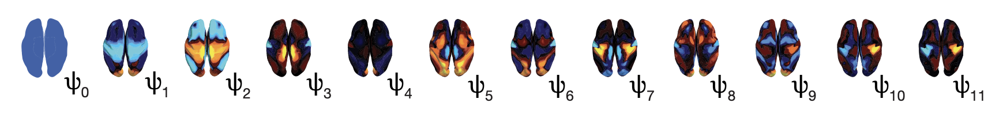

# HArmonic DEcomposition of Spacetime

Code related to the paper titled "[The flattening of spacetime hierarchy of the DMT brain state is characterised by harmonic decomposition of spacetime (HADES) framework](https://academic.oup.com/nsr/advance-article/doi/10.1093/nsr/nwae124/7640873)"

The Harmonic Decomposition of Spacetime (HADES) framework that characterises how different harmonic modes defined in space are expressed over time. Here applied to the DMT dataset

## Folder descriptions

1. `data/`: folder containing data for the different steps of the HADES pipleine - decomposition, projections, dataset analysis and plotting
2. `utils/`: folder containing matlab functions for the different steps of the HADES pipleine - decomposition, projections, dataset analysis and plotting
3. `results/`: folder containing various outputs for the different steps of the HADES pipleine - decomposition, projections, dataset analysis and plotting
4. `figures/`: folder containing figures for the different steps of the HADES pipleine - decomposition, projections, dataset analysis and plotting

## File descriptions

1. `p1_HADES_DMT_FMRI_main_projectFH.m`: MATLAB script to project functional harmonics onto the timeseries
2. `p2_HADES_DMT_spatiotemporal_analysis.m`: MATLAB script to calculate the spatio-temporal analysis
3. `p3_HADES_DMT_dynamic_analysis_publication.m`: MATLAB script to calculate dynamic analysis
4. `p4_HADES_DMT_latent_space_analysis_publication.m`: MATLAB script to calculate latent space analysis analysis

## Auxilary File descriptions
1. `HCP_denseFC_2_vertices.m`: MATLAB script to load the dense FC
2. `HADES_basis_denseFC_vertex_on_HCP.m`: MATLAB scripts to run the laplace decomposition on the dense FC
3. `HADES_plotting_basis.m`: MATLAB script to plot the functional harmonics on the cortical surface
4. `DMT_FMRI_main_projectsFH`: MATLAB script to run the Functional Harmonic projections to the DMT dataset

## Installation
Simply download the repository to get started.
In order to run the code two additional files (Functional Harmonics (FHs) and projections of FHs to the DMT dataset) have to be downloaded from the OSF repository: https://osf.io/asntf/ you can find further instruction in the results folder.

HADES pipeline [p1-p4].

To run the code p1 uses the FHs projections on the fMRI resting-state data. The OSF repository provided the FHs projections onto the DMT dataset.

For personal use the appropriate dataset FHs projections should be provided in the cifti 64k vertices format.

Inside each code file, you'll find comments and documentation to guide you through usage.
The repository serves as standalone for the HADES method. Please Consult the documentiaton for further guidance

## Downloading data
Due to privacy the DMT data is only provided in terms of the FHs projections. The original data is available upon request from the authors of the experiment.
To derive the Functional Harmonics, the dense functional connectome of the HCP dataset was used and can be accessed here.
Important: Certain parts of generate_paper_figures.m and generate_paper_suppfigures.m rely on this OSF-hosted data. Ensure it's saved in the correct folders for smooth script execution.

## Original data
The original empirical data stem from the Human Connectome Project. Refer to the provided link for comprehensive access, licensing, and usage terms.
## Dependencies
Relevant toolboxes and repositories. Some MATLAB-based scripts rely on external packages. Copies are stored in utils/ for version compatibility. Visit the provided links for detailed information and support.

SPM12        - [Statistical Parametric Mapping Toolbox](https://www.fil.ion.ucl.ac.uk/spm/software/spm12/)

gifti        - [Freesurfer Toolbox](https://surfer.nmr.mgh.harvard.edu/fswiki/GIfTI)

cifti        - [Human Connectome Workbench](https://www.humanconnectome.org/software/workbench-command/-cifti-help)

spider plots - [Chart Development Toolbox version1.3 (Nov 2019)](https://uk.mathworks.com/matlabcentral/fileexchange/65857-chart-development-toolbox#version_history_tab)

Atasoy et al. scripts based on papers on Connectome Harmonics. ([Atasoy2016](https://www.nature.com/articles/ncomms10340), [Atasoy2017](https://doi.org/10.1038/s41598-017-17546-0), [Atasoy2018](https://doi.org/10.1016/bs.pbr.2018.08.009))

Cabral et al. scripts based on papers on Leadin Eigenvector Analysis (LEiDA). ([Cabral2017](https://www.nature.com/articles/s41598-017-05425-7), [Vohryzek2020](https://www.frontiersin.org/articles/10.3389/fnsys.2020.00020/full))

## Compatibility
Codes are tested on MATLAB versions R2023b.

## Citation
[Article] J. Vohryzek,J. Cabral, C. Timmermann, S. Atasoy, L. Roseman, D.J. Nutt, R.L. Carhart-Harris, G. Deco, M.L. Kringelbach, The flattening of spacetime hierarchy of the DMT brain state is characterised by harmonic decomposition of spacetime (HADES) framework, NSR (2023) (DOI: [10.1093/nsr/nwae124](https://academic.oup.com/nsr/advance-article/doi/10.1093/nsr/nwae124/7640873))

[Preprint] J. Vohryzek,J. Cabral, C. Timmermann, S. Atasoy, L. Roseman, D.J. Nutt, R.L. Carhart-Harris, G. Deco, M.L. Kringelbach, Harmonic decomposition of spacetime (HADES) framework characterises the spacetime hierarchy of the DMT brain state, bioRxiv (2023) (DOI: [10.1101/2023.08.20.554019](https://www.biorxiv.org/content/10.1101/2023.08.20.554019v1.abstract))

## Further details
contact jakub.vohryzek@upf.edu
